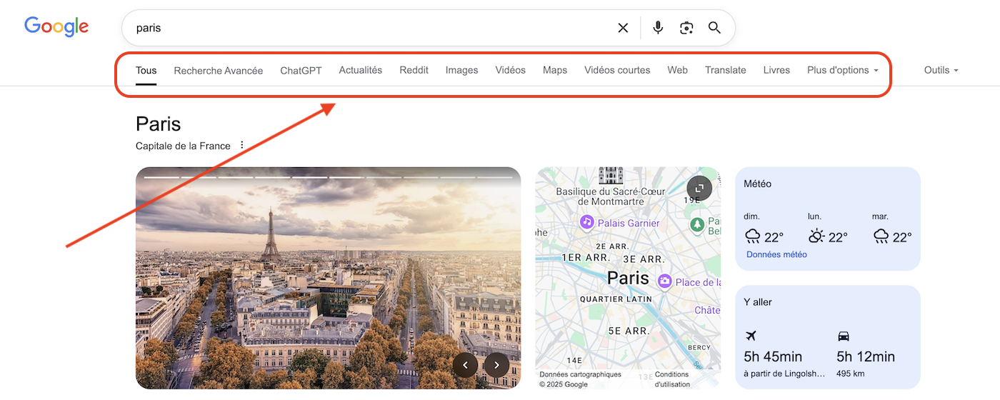
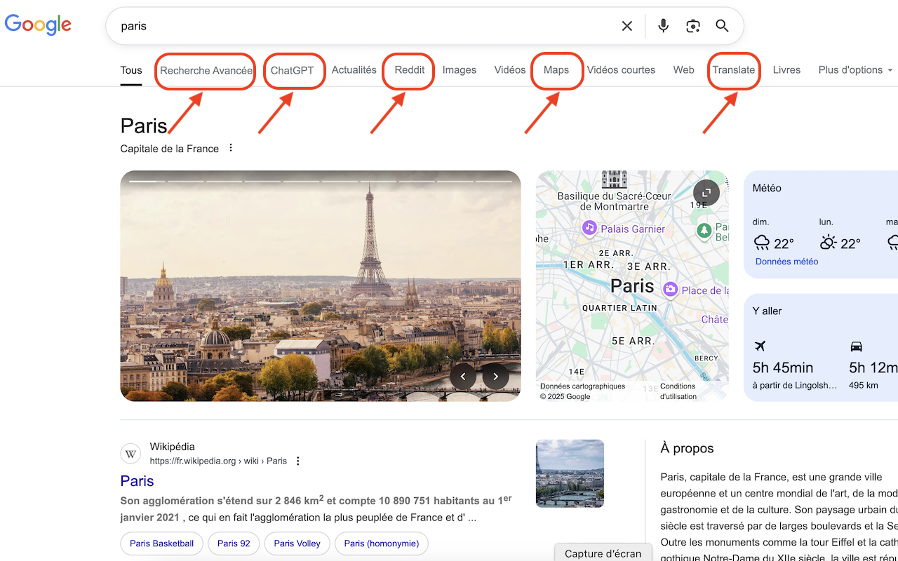
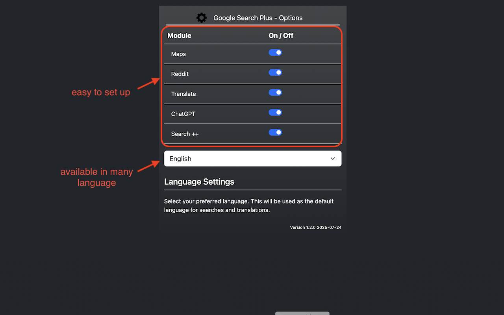
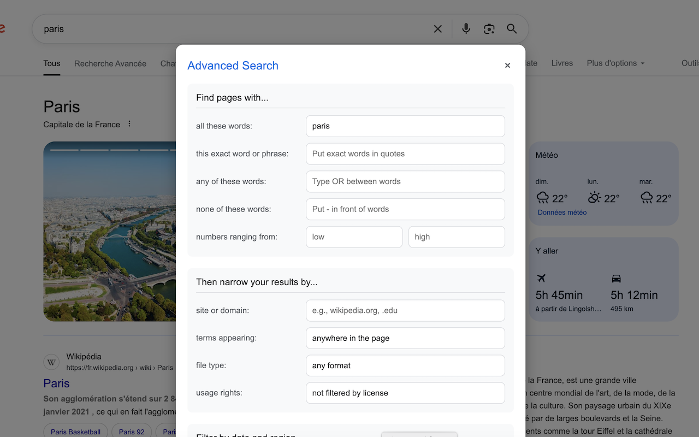
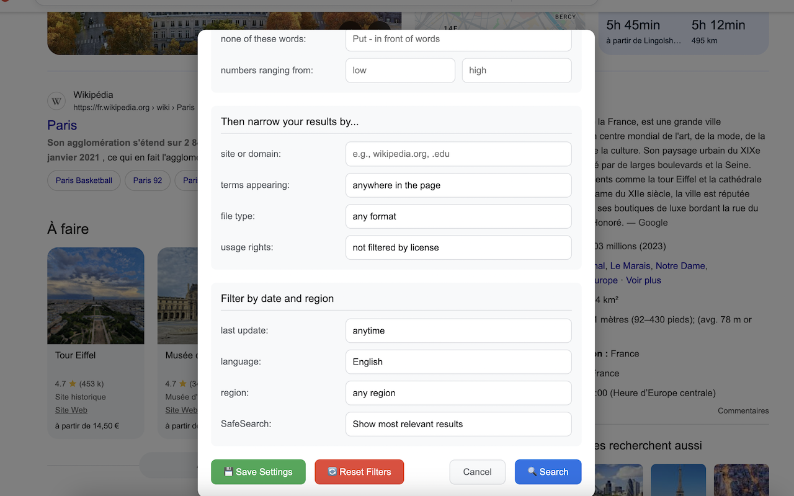

# Google Search Plus

**Google Search Plus** is a free Chrome extension that enhances your Google search experience with powerful features and quick access to popular services directly from the search results page.

## Features

### 🗺️ Maps Integration
Instantly search for locations on Google Maps with a single click. The extension adds a Maps button to the Google search navigation bar, allowing you to seamlessly switch from a regular search to a Maps search with the same query.

### 🤖 ChatGPT Integration
Ask ChatGPT about your search query directly from Google. The extension adds an AI button that takes your current search query and sends it to ChatGPT, making it easy to get AI-powered insights without manually copying and pasting.

### 🌐 Translation Support
Quickly translate your search query with a single click. The Translate button uses your preferred language settings to instantly translate your search terms using Google Translate.

### 🔄 Reddit Integration
Find discussions about your search topic on Reddit with a single click. The Reddit button takes your current search query and searches Reddit for relevant conversations.

### 🔍 Advanced Search
Access powerful search filters and options without remembering complex search operators. The Advanced Search feature provides an intuitive interface for:
- Searching for exact phrases, any/all/none of specific words
- Filtering by number ranges
- Limiting results to specific sites or domains
- Searching within specific parts of pages (title, URL, text, links)
- Filtering by file type (PDF, DOC, XLS, etc.)
- Setting usage rights filters
- Filtering by date, including precise date ranges
- Setting language and region preferences
- Controlling SafeSearch settings

## Productivity Benefits

- **Save Time**: Access multiple services with a single click instead of opening new tabs and retyping your search
- **Streamline Research**: Quickly compare results across different platforms (Google, Maps, Reddit, ChatGPT)
- **Enhance Search Precision**: Use advanced search features without memorizing complex operators
- **Reduce Context Switching**: Stay focused on your task with integrated tools in one place
- **Customize Your Experience**: Enable only the modules you need and set your preferred language

## Installation

1. Download the extension from the Chrome Web Store
2. Click "Add to Chrome" to install
3. The extension will automatically activate when you visit Google Search

## Usage

After installation, you'll notice new buttons in the Google search navigation bar:
- **Maps**: Click to search for your query on Google Maps
- **Reddit**: Click to search for your query on Reddit
- **Translate**: Click to translate your query using Google Translate
- **IA**: Click to ask ChatGPT about your query
- **Advanced Search**: Click to open the advanced search panel with powerful filtering options

## Language Support

Google Search Plus is available in multiple languages:
- English
- Français (French)
- Deutsch (German)
- Español (Spanish)
- Italiano (Italian)
- 日本語 (Japanese)
- 简体中文 (Simplified Chinese)
- 繁體中文 (Traditional Chinese)
- العربية (Arabic)
- हिन्दी (Hindi)
- Portugês (Portuguese)
- Русский (Russian)
- And more!

The extension will automatically use your browser's language, or you can set your preferred language in the options.

## Privacy

Google Search Plus respects your privacy:
- No data collection or tracking
- No ads or monetization
- Minimal permissions (only accesses Google search pages)
- All functionality works locally in your browser

## Permissions

Google Search Plus requires the following permissions to function properly:

### 🔒 Host Permissions
- **Google.com**: Required to modify the Google search results page and add buttons to the navigation bar. This permission is limited to Google search pages only.

### 🔑 Extension Permissions
- **Storage**: Used to save your preferences (enabled modules and language settings) between sessions.
- **Tabs**: Used only to reload extension pages when you change your language preference.

All permissions are used solely to provide the extension's core functionality and enhance your search experience. No data is collected, stored externally, or shared with third parties.

## Open Source

This extension is open source and free to use. Contributions are welcome!

## Support

If you encounter any issues or have suggestions for improvements, please open an issue on the GitHub repository.

---

Enhance your Google search experience today with Google Search Plus - the free, privacy-friendly extension that brings powerful tools right to your search results!
